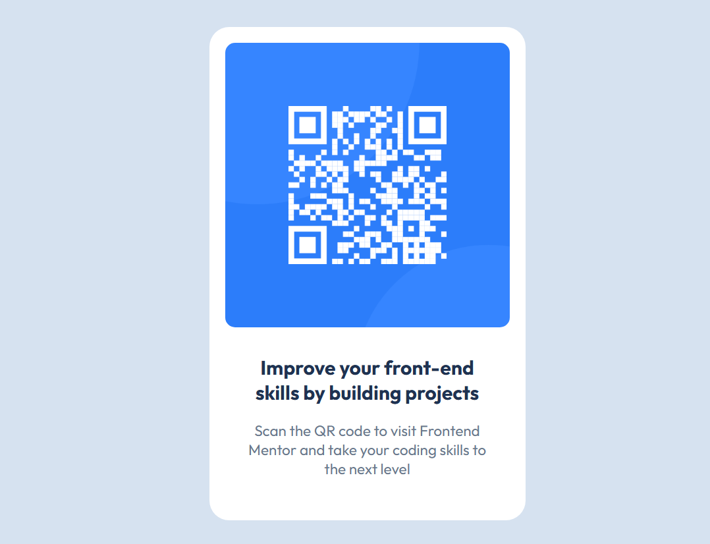

# Frontend Mentor - QR code component solution

This is a solution to the [QR code component challenge on Frontend Mentor](https://www.frontendmentor.io/challenges/qr-code-component-iux_sIO_H). Frontend Mentor challenges help you improve your coding skills by building realistic projects.

## Table of contents

- [Overview](#overview)
  - [Screenshot](#screenshot)
  - [Links](#links)
- [My process](#my-process)
  - [Built with](#built-with)
  - [What I learned](#what-i-learned)
  - [Continued development](#continued-development)
- [Author](#author)

## Overview

This is my first HTML & CSS project, and I coded it entirely on my own. It was a really satisfying experience because I learned several awesome skills—like how to translate a Figma design into clean code, how to use browser DevTools effectively for debugging, and many other small but exciting techniques that improved my workflow.

### Screenshot

### Links

- Solution URL: (https://github.com/ahmed-maher0/QR-code-component-challenge01)
- Live Site URL: (https://ahmed-maher0.github.io/qr-code-component-challenge01/)

## My process

I started by reviewing the Figma design and identifying the main layout structure. From there, I wrote the HTML using simple, semantic elements, then styled the component with CSS. I used Flexbox to center the card, set up spacing and typography based on the design, and refined everything using browser DevTools. I made small adjustments along the way until the component matched the design as closely as possible.

### Built with

- Semantic HTML5 markup
- CSS custom properties
- Flexbox

### What I learned

This challenge helped strengthen my HTML and CSS fundamentals. I learned how to translate a Figma design into code, structure semantic HTML, and center elements with Flexbox. I also got more comfortable using CSS variables, debugging with DevTools, and writing cleaner, more organized CSS.

### Continued development

Moving forward, I want to keep improving my CSS layout skills (Flexbox and Grid), get better at building fully responsive designs, and write cleaner, more maintainable CSS. I also plan to sharpen my design sense and continue using DevTools more efficiently as I take on more Frontend Mentor challenges.

## Author

- Website - [Ahmed Maher](https://www.ahmedmaher.site)
- Frontend Mentor - [@ahmed-maher0](https://www.frontendmentor.io/profile/ahmed-maher0)
- Twitter - [@abomaher09](https://x.com/abomaher09)
